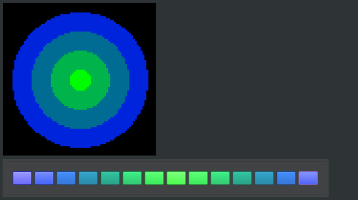

Canvases and Image Editing
==========================

A Canvas lets you draw custom shapes and images onto a Section. This works like a `raster image editor <https://en.wikipedia.org/wiki/Raster_graphics>`_.

.. _canvases-overview:
Overview
--------

A ``Canvas`` is a drawing surface where you can create shapes, write text, free draw, and add other objects to your Section.

*A ``Canvas`` with its associated palette.*

Canvases are rendered after Animations, meaning you can draw a Canvas on top of an Animation. Like :doc:`Animations <Animations>`, Canvases rely on ``Palettes``. Canvases are transparent by default.

.. Tip:: The same ``Palettes`` can be used for both ``Animations`` and ``Canvases``.

.. _canvases-creating:
Creating a Canvas
-----------------

Create a new Canvas using ``Section::set_canvas(uint16_t num_frames)``. ``num_frames`` is an optional parameter for creating :ref:`canvases-animated`. By default, Canvases have a single frame. Frames are described in more detail in the section :ref:`canvases-frames`.

.. code-block:: c++

   // Declare a new Canvas with a single frame
   Canvas& canvas = section.set_canvas();

To create an animated ``Canvas``, set the number of frames to 2 or more.

.. code-block:: c++

   int num_frames = 10;
   // Declare a new Canvas with 10 frames
   Canvas& canvas = section.set_canvas(num_frames);

.. _canvases-palette:
Setting the Palette
^^^^^^^^^^^^^^^^^^^

Canvases require you to set a :doc:`Palette <Palettes>`. Use ``Canvas::set_palette(Palette& palette)`` to set the palette.

.. code-block:: c++

   Canvas& canvas = section.set_canvas();
   canvas.set_palette(ColorPresets::Colorwheel_Palette);

.. _canvases-animating:
Animating a Canvas
------------------

Canvases can also display animations. Unlike :doc:`Section Animations <Animations>`, which use dynamically generated patterns, animated Canvases allow for a much higher degree of customization.

.. _canvases-frames:
Frames
^^^^^^

The area that you draw on a Canvas is called a ``frame``. A frame is a drawing surface that shares the dimensions of its parent Section. When a Canvas has more than one frame, it renders each frame on a set interval, essentially turning it into a video player.

You can specify the number of frames when initializing the Canvas using ``Section::set_canvas()``. You can also change the number of frames in an existing Canvas using ``Canvas::set_num_frames()``. Note that this will ***delete*** the current frame set. You can change the amount of time (in milliseconds) between frames using ``Canvas::set_frame_timer(milliseconds)``.

.. _canvases-switching-frames:
Switching Frames
^^^^^^^^^^^^^^^^

The Canvas keeps track of the frame that's currently displayed. This is known as the *active frame.* To display a different frame, switch to the frame using ``set_current_frame_index(index)``. You can also use ``next_frame()`` to change to the next available frame (or to the first frame if you're currently on the last frame). To get the index of the current frame, use ``get_current_frame_index()``.

.. _canvases-drawing-shapes:
Drawing Shapes
--------------

You can draw on a Canvas using one of the following ``draw`` methods. Each method requires the index of the frame to draw on, the starting point (as x and y coordinates), the ending point (or size, depending on the draw method), and extra parameters specific to the shape or pattern.

Canvases use the same Cartesian coordinate system as Sections to track Pixels. The origin (0, 0) is at the top-left corner of the grid, with positive values moving to the right and down. For example, (5, 10) means 5 pixels to the right and 10 pixels down.

.. _canvases-selecting-color:
Selecting a Color
^^^^^^^^^^^^^^^^^

When drawing, you must specify the color that you want to draw in according to its index in the ``Palette``. Each ``draw`` method requires this index as a parameter to determine how to draw the shape.

.. code-block:: c++

   // Draws a single point 10 Pixels to the right and 10 Pixels down using the 6th color in the Palette index
   canvas.draw_point(6, 10, 10);

.. _canvases-lines:
Lines
^^^^^

The ``draw_line()`` method draws a line from one point to another. Enter the coordinate where the line starts and the coordinate where the line ends.

.. code-block:: c++

   // Draw a 10 Pixel long diagonal line
   canvas.draw_line(0, 0, 0, 10, 10);

.. _canvases-points:
Points
^^^^^^

The ``draw_point()`` method draws a single point. You can erase the point using ``erase_point()``.

.. code-block:: c++

   // Draw a single point 5 pixels under the origin, then erase it.
   canvas.draw_point(0, 0, 5);
   canvas.erase_point(0, 5);

.. _canvases-rectangles:
Rectangles
^^^^^^^^^^

The ``draw_rect()`` method draws a basic non-rotated rectangle with the specified origin, size, and whether to ``fill`` the rectangle or just draw the outline.

.. code-block:: c++

   // Draw the outline of a 10 x 10 rectangle
   bool fill = false;
   canvas.draw_rect(0, 0, 0, 10, 10, fill);

.. _canvases-text:
Text
^^^^

.. Important:: Drawing text requires ``Fonts``, which take up a relatively significant amount of RAM and program space. Because of this, they are disabled by default. To enable them, add the ``CANVAS_ENABLE_FONTS`` preprocessor directive to your project. In the Arduino IDE, add ``#define CANVAS_ENABLE_FONTS`` to the top of your .ino file. In PlatformIO, add the following to your platformio.ini file:

.. code-block:: ini

   [common]
   build_flags = -D CANVAS_ENABLE_FONTS

The ``draw_text()`` method draws a string of characters. Specify the origin, a ``Font``, and the ``text`` to display.

.. code-block:: c++

   // Draws "PixelMaestro" at the Canvas' origin in a 5x8 font
   Font *font = new Font5x8();
   canvas.draw_text(0, 0, 0, *font, "PixelMaestro");

.. _canvases-triangles:
Triangles
^^^^^^^^^

The ``draw_triangle()`` method draws a triangle with the three specified coordinates. You can also ``fill`` the triangle, or just draw an outline.

.. code-block:: c++

   // Draws a filled in right-angle triangle 10 pixels high and 10 pixels wide
   canvas.draw_triangle(0, 0, 0, 10, 0, 0, 10, true);

.. _canvases-clearing:
Clearing the Canvas
^^^^^^^^^^^^^^^^^^^

Use ``clear()`` to erase the entire Canvas (including all frames). You can clear a single Pixel using the ``erase_point()`` method. Note that once you clear a Canvas, there's no way to recover its contents.
