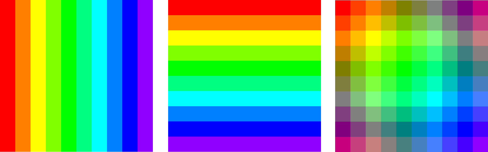

Sections
========

A Section is a logical representation of :doc:`Pixels <Pixels>` laid out in a 2D grid. In addition to storing the Pixel grid, Sections bridge components that modify each Pixel's color values, particularly :doc:`Animations <Animations>` and :doc:`Canvases <Canvases>`. Sections are managed by :doc:`Maestros <Maestros>`, with one Maestro managing multiple Sections.

.. _sections-creating:
Creating a Section
------------------

A Section can be created in one of two ways: explicitly by initializing a ``Section`` object and assigning it to a Maestro, or implicitly while initializing a Maestro. In either case, you will need to specify the :doc:`dimensions <Points>` of the Section in terms of rows and columns.

.. Note:: A single Maestro can manage up to 256 Sections.

When creating a ``Section`` explicitly, you will need to assign the Section to a Maestro using ``Maestro::set_sections(Section* sections, uint8_t num_sections)``. The following example creates and assigns two Sections to a Maestro: one 10 pixels wide and 20 pixels tall, and another 30 pixels wide and 40 pixels tall:

.. code-block:: c++

   Section sections[2] = {
       Section(10, 20),
       Section(30, 40);
   }
   Maestro maestro(sections, 2);

To declare a Section implicitly, declare a ``Maestro`` object and pass the dimensions of the Section. This example allocates a single 10x20 Section. This Section is fully managed by the Maestro: if the Maestro is deleted, so is the Section.

.. code-block:: c++

   Maestro maestro(10, 20, 1);

.. _sections-updating:
Updating a Section
------------------

To update a Section, call ``Section::update(uint32_t runtime)``. This updates the Section along with any components managed by the Section including Animations, Canvases, and Layers.

.. Note:: Instead of calling this method directly, you should use ``Maestro::update()``, which automatically calls this method for you.

.. code-block:: c++

   section.update(millis());

.. _sections-interacting:
Interacting With the Pixel Grid
-------------------------------

After calling the Section's constructor, the Section automatically allocates a :doc:`Pixel <Pixels>` grid with the dimensions specified. This grid is logically laid out as a `Cartesian plane <https://en.wikipedia.org/wiki/Cartesian_coordinate_system>`_, with the origin (0, 0) starting in the top-left corner and increasing as you move to the right and down. For example, the coordinates (3, 5) represent a pixel 3 spaces to the right and 5 spaces down.

.. _sections-setting-pixel-color:
Setting a Pixel's Color
^^^^^^^^^^^^^^^^^^^^^^^

You can write colors directly to a Pixel using ``Section::set_pixel_color(uint8_t x, uint8_t y, Colors::RGB& color)``.

.. code-block:: c++

   Colors::RGB blue = {0, 0, 255};
   section.set_pixel_color(3, 5, blue);

Note that other components also use ``set_pixel_color()`` and may overwrite your changes. To avoid this, run ``set_pixel_color()`` after ``Section::update()`` in your control loop.

.. _sections-retrieving-pixel-color:
Retrieving a Pixel's Color
^^^^^^^^^^^^^^^^^^^^^^^^^^

There are two ways of retrieving a Pixel's color from a Section.

The first returns the Pixel's post-processed color. This takes the Pixel's color and applies any layered or post-processing effects such as Canvases, Layers, brightness, etc. This is the method you'll want to use, since it offers the greatest number of features. To get the color, use ``Section::get_pixel_color(uint16_t x, uint16_t y)``, where ``x`` and ``y`` are the coordinates of the Pixel.

The second method returns the Pixel's "true" color, or the color stored in memory. This is the Pixel's color before any effects have been applied, and is really only useful for manually setting colors and Animations. However, it's much less CPU-intensive. To get the color, use ``Section::get_pixel(x, y).get_color()``.

.. _sections-animating:
Animating a Section
-------------------

Animations let you display dynamic visual effects on a Section. To learn more, see :doc:`Animations <Animations>`.

.. _sections-canvases:
Displaying Custom Shapes and Patterns
-------------------------------------

Canvases let you draw custom shapes and patterns onto a Section. To learn more, see :doc:`Canvases <Canvases>`.

.. _sections-brightness:
Setting a Brightness Level
--------------------------

You can change the Section's overall brightness using ``Section::set_brightness(uint8_t brightness)``. Brightness sets the luminosity of each Pixel. You can set the brightness on a scale between 0-255, with 0 being unlit and 255 being fully lit.

.. _sections-layers:
Using Layers
------------

A Layer is a second Section rendered on top of an existing Section. When rendering the base Section, the color output of the Layer is merged with that of the base, creating a composite image. You can learn more about color merging in the :doc:`Colors <Colors>` document.

.. Warning:: Be careful when using Layers on low-memory devices. Adding a Layer creates a second framebuffer, requiring lots of RAM.

*Layering Section 2 (center) on top of Section 1 (left) using the alpha MixMode results in Section 3 (right).*

Create a Layer by calling ``Section::set_layer(Colors::MixMode mix_mode, uint8_t alpha)``. ``MixMode`` is the method used to combine the Layer's colors with those of the base Section, and ``alpha`` sets the percentage that the Layer's colors are blended with the base's colors. Note that ``alpha`` only applies when using the Alpha MixMode.

This method returns a new ``Layer``, object, which contains a newly initialized ``Section`` object wholly independent of the base Section. You can access the Layer using ``Section::get_layer()``, and you can access the layered Section using ``Section::get_layer()->section``. You can perform any normal action on this layered Section including adding an Animation or Canvas.

Since any Section can have a Layer, you can stack Layers on top of other Layers by calling ``Layer::section.set_layer()``. For example, to add two new Layers onto a Section, you could use ``Section::get_layer()->section.set_layer(mix_mode, alpha)->section.set_layer(mix_mode_2, alpha_2)``.

.. code-block:: c++

   Section base(10, 10);
   ...
   // Creates a new Layer and sets its Animation.
   // The final color will be 50% of the base color and 50% of the overlaid color.
   Layer& layer = base.set_layer(Colors::MixMode::Alpha, 127);
   Animation& layer_animation = layer.section->set_animation(AnimationType::RadialAnimation);
   layer_animation.set_palette(ColorPresets::Colorwheel_Palette);

.. _sections-scrolling:
Scrolling
---------

Scrolling shifts the entire pixel grid across the Section, making it appear as if the Section is moving laterally and/or vertically. Scrolling is measured in terms of speed (how long it takes to scroll any one pixel from one end of the Section to the other). ``Section::set_scroll(uint16_t x_interval, uint16_t y_interval, bool x_reverse, bool y_reverse)`` sets both the amount of time to complete a scroll and the direction to scroll across the x and y axes. ``interval`` is the amount of time it takes for the Section to complete a single scroll, and ``reverse`` swaps the direction of the scroll. By default, scrolling on the x axis moves the grid from right to left, and scrolling on the y axis moves the grid from bottom to top.

.. Tip:: The apparent scrolling speed changes relative to the size of the grid. A 10x10 grid will appear to scroll much slower than a 50x50 grid even if they both have the same scroll interval. This is because the 50x50 grid needs to cover a larger distance (50 pixels) in the same amount of time that the smaller grid only needs to cover 10.

This example scrolls to the right once every 2000 milliseconds and down once every 1000 milliseconds.

.. code-block:: c++

   section.set_scroll(2000, 1000, false, true);

To disable scrolling on either axis, set its scroll rate to 0. You can also completely disable scrolling by calling ``Section::remove_scroll()``.

.. Tip:: Disabling scrolling will stop the grid in its current location. If you want to move the grid back to the center, set its :ref:`offset <offsetting>` to 0.

.. _sections-offsetting:
Offsetting
^^^^^^^^^^

Offsetting shifts the Section from its default position by a certain number of pixels. This is similar to :ref:`scrolling`, except it's a one-time operation.

.. Note:: If scrolling is enabled, the offset values will be overridden each time the Section updates.

.. code-block:: c++

   section.set_offset(5, 1);

.. _sections-wrapping:
Wrapping
^^^^^^^^

If a Section is offset, Pixels shifted out of bounds automatically wrap around to the other side of the grid. If wrapping is disabled, these Pixels are instead not shown at all. This is useful for things like scrolling text off-screen.

.. code-block:: c++

    section.set_wrap(false);

.. _sections-mirroring:
Mirroring
---------

Mirroring shows a reflection of the Section across the center of the x or y axis.

.. code-block:: c++

   bool mirror_x = true;
   bool mirror_y = false;
   section.set_mirror(mirror_x, mirror_y);
